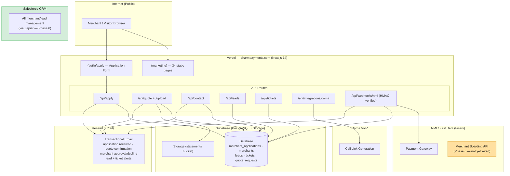

# Charm Payments — Full Infrastructure Audit
**Date:** 2026-04-15  
**Auditor:** Claude Code (claude-sonnet-4-6)  
**Status:** READ-ONLY — no files modified

---

## Table of Contents
1. [Codebase Structure](#1-codebase-structure)
2. [Database Schema (Supabase)](#2-database-schema-supabase)
3. [Recent Git History](#3-recent-git-history)
4. [API Route Inventory](#4-api-route-inventory)
5. [Component Inventory](#5-component-inventory)
6. [Pipedrive Removal Audit](#6-pipedrive-removal-audit)
7. [Infrastructure Map (Mermaid)](#7-infrastructure-map)
8. [Recommendations](#8-recommendations)

---

## 1. Codebase Structure

### 1.1 Directory Tree

```
src/
├── app/
│   ├── (admin)/                        # Admin portal
│   │   └── admin/
│   │       ├── applications/           # Review list + detail
│   │       ├── leads/                  # Lead CRM view
│   │       ├── merchants/              # Approved merchant list
│   │       ├── tickets/                # Support tickets
│   │       ├── admins/                 # Admin user management
│   │       └── layout.tsx              # Admin shell (AdminSidebar)
│   ├── (auth)/
│   │   ├── apply/
│   │   │   └── pending/                # Post-apply holding page
│   │   ├── login/
│   │   ├── forgot-password/
│   │   └── auth/callback/              # Supabase OAuth callback
│   ├── (dashboard)/
│   │   ├── dashboard/
│   │   │   ├── page.tsx                # Overview / KPIs
│   │   │   ├── accounts/               # Bank account management
│   │   │   ├── transactions/           # Transaction history
│   │   │   ├── wallet/                 # Stripe Treasury wallet
│   │   │   ├── payouts/                # Settlement records
│   │   │   ├── disputes/               # Chargeback tracking
│   │   │   ├── equipment/              # NMI hardware catalog
│   │   │   ├── tickets/                # Support tickets
│   │   │   └── settings/               # Merchant profile settings
│   │   └── layout.tsx                  # Auth guard + Sidebar + Header
│   ├── (marketing)/
│   │   ├── page.tsx                    # Homepage
│   │   ├── about/
│   │   ├── pricing/
│   │   ├── contact/
│   │   ├── faq/
│   │   ├── privacy/
│   │   ├── terms/
│   │   ├── unsubscribe/
│   │   ├── charm-cards/                # Branded card product
│   │   ├── gateway/                    # Gateway product page
│   │   ├── cards/                      # Card solutions
│   │   ├── wallet/                     # Wallet product
│   │   ├── features/                   # 9 feature sub-pages
│   │   │   ├── virtual-terminal/
│   │   │   ├── tap-to-pay/
│   │   │   ├── card-present/
│   │   │   ├── invoicing/
│   │   │   ├── text-to-pay/
│   │   │   ├── recurring-billing/
│   │   │   ├── ach/
│   │   │   ├── ecommerce/
│   │   │   └── qr-codes/
│   │   └── solutions/                  # 7 vertical sub-pages
│   │       ├── mobile/
│   │       ├── ecommerce/
│   │       ├── restaurants/
│   │       ├── retail/
│   │       ├── services/
│   │       ├── beauty/
│   │       └── high-risk/
│   └── api/
│       ├── apply/                      # Merchant application
│       ├── quote/                      # Rate audit form
│       │   └── upload/                 # Statement file upload
│       ├── contact/                    # Contact form
│       ├── leads/                      # Lead CRUD
│       ├── tickets/                    # Ticket CRUD
│       ├── auth/
│       │   ├── callback/               # Supabase auth redirect
│       │   └── forgot-password/
│       ├── admin/
│       │   └── applications/
│       │       ├── route.ts            # List with filters
│       │       └── [id]/
│       │           ├── route.ts        # Single application
│       │           ├── approve/
│       │           ├── decline/
│       │           └── review/
│       ├── integrations/
│       │   ├── pipedrive/              # Manual/test sync — REMOVE
│       │   ├── ooma/                   # Call logging
│       │   └── nmi/                    # NMI webhook
│       ├── wallet/
│       │   ├── balance/
│       │   ├── transactions/
│       │   ├── transfer/
│       │   └── onboard/
│       ├── webhooks/
│       │   └── nmi/                    # NMI payment webhook
│       └── dashboard/
│           └── equipment/
│               └── order/             # Equipment purchase/lease
├── components/
│   ├── admin/
│   │   ├── AdminSidebar.tsx
│   │   └── ApplicationReviewForm.tsx
│   ├── dashboard/
│   │   ├── Sidebar.tsx
│   │   ├── Header.tsx
│   │   ├── MobileNav.tsx
│   │   ├── DashboardPageHeader.tsx
│   │   ├── leads-dashboard-client.tsx  # Orphaned — references pipedrive_deal_id; source page deleted
│   │   ├── EquipmentCatalogClient.tsx
│   │   └── wallet-transfer-form.tsx
│   ├── marketing/
│   │   ├── Navbar.tsx
│   │   ├── Footer.tsx
│   │   └── (various section components)
│   ├── conversion/
│   │   ├── PrimaryCTA.tsx
│   │   ├── ProofSection.tsx
│   │   ├── SavingsCalculator.tsx
│   │   ├── SocialProofStrip.tsx
│   │   └── StatsBar.tsx
│   ├── forms/
│   │   ├── apply-application-form.tsx
│   │   └── quote-form.tsx
│   └── ui/
│       ├── Button.tsx
│       ├── Input.tsx
│       ├── StatCard.tsx
│       ├── Badge.tsx
│       ├── ScrollReveal.tsx
│       ├── FadeIn.tsx
│       ├── FloatingCard.tsx
│       └── HeroVisual.tsx
├── lib/
│   ├── supabase/
│   │   ├── client.ts                   # Browser Supabase client
│   │   ├── server.ts                   # Server-side Supabase client
│   │   └── admin.ts                    # Service-role admin client
│   ├── integrations/
│   │   ├── pipedrive.ts                # ENTIRE FILE TO REMOVE
│   │   ├── ooma.ts                     # VoIP call logging
│   │   ├── nmi.ts                      # NMI gateway client
│   │   └── notifications.ts            # Resend notification helpers
│   ├── services/
│   │   ├── lead-service.ts             # Lead CRUD + Pipedrive sync
│   │   ├── ticket-service.ts           # Support ticket CRUD
│   │   └── stripe-service.ts           # Stripe Treasury ops
│   ├── auth/
│   │   └── require-admin.ts            # Admin route guard
│   ├── validators/
│   │   ├── lead-payload.ts             # Zod schema for leads
│   │   └── ticket-payload.ts           # Zod schema for tickets
│   ├── utils.ts
│   ├── api-response.ts
│   ├── email.ts                        # Resend email templates
│   ├── stripe.ts                       # Stripe singleton
│   └── nmi-products.ts                 # Static NMI product data
├── hooks/
│   └── useScrollReveal.ts
└── types/
    ├── lead.ts                         # Lead type with Pipedrive fields
    ├── integration.ts                  # IntegrationProvider union type
    └── (others)
```

### 1.2 Environment Variables Referenced in Code

| Variable | Files | Purpose |
|---|---|---|
| `NEXT_PUBLIC_SUPABASE_URL` | lib/supabase/client.ts, server.ts, admin.ts | Supabase project URL |
| `NEXT_PUBLIC_SUPABASE_ANON_KEY` | lib/supabase/client.ts, server.ts | Supabase public anon key |
| `SUPABASE_SERVICE_ROLE_KEY` | lib/supabase/admin.ts | Service-role key (admin ops only) |
| `NEXT_PUBLIC_SITE_URL` | api/apply, api/contact, lib/email.ts, api/admin/approve | Site URL for email links |
| `RESEND_API_KEY` | api/apply, api/contact, lib/email.ts | Transactional email (critical) |
| `PIPEDRIVE_API_TOKEN` | lib/integrations/pipedrive.ts, api/apply, api/quote | **TO REMOVE** |
| `PIPEDRIVE_DOMAIN` | lib/integrations/pipedrive.ts | **TO REMOVE** |
| `PIPEDRIVE_QUOTE_STAGE_ID` | api/quote/route.ts | **TO REMOVE** |
| `OOMA_ACCOUNT_ID` | lib/integrations/ooma.ts | VoIP call link generation |
| `OOMA_EXTENSION` | lib/integrations/ooma.ts | VoIP extension |
| `STRIPE_SECRET_KEY` | lib/stripe.ts, lib/services/stripe-service.ts | Stripe server SDK |
| `NEXT_PUBLIC_STRIPE_PUBLISHABLE_KEY` | Stripe client components | Stripe public key |
| `STRIPE_WEBHOOK_SECRET` | Stripe webhook handler | Webhook signature verification |
| `NMI_SECURITY_KEY` | lib/integrations/nmi.ts | NMI gateway authentication |
| `NMI_PUBLIC_KEY` | lib/integrations/nmi.ts | NMI gateway public key |
| `NEXT_PUBLIC_NMI_TOKENIZATION_KEY` | NMI client-side tokenization | NMI JS library key |

**Defined in .env.example but NOT yet wired in code:**
- `NMI_SECURITY_KEY` / `NMI_PUBLIC_KEY` / `NEXT_PUBLIC_NMI_TOKENIZATION_KEY` — NMI boarding API not yet fully implemented

### 1.3 External Service Integrations

| Service | Integration File | Routes | Status |
|---|---|---|---|
| **Supabase** | lib/supabase/* | All API routes | Active |
| **Resend** | lib/email.ts, lib/integrations/notifications.ts | apply, quote, contact, admin approve/decline, forgot-password | Active |
| **Pipedrive** | lib/integrations/pipedrive.ts | apply, quote, integrations/pipedrive, integrations/ooma | Active — **TO REMOVE** |
| **Ooma** | lib/integrations/ooma.ts | integrations/ooma | Active (remove Pipedrive call from this file only) |
| **Stripe** | lib/stripe.ts, lib/services/stripe-service.ts | api/wallet/* | Active |
| **NMI** | lib/integrations/nmi.ts, lib/nmi-products.ts | api/integrations/nmi, api/webhooks/nmi | Partially wired (webhook stub + product data; boarding API not yet implemented) |

### 1.4 Stale / Unused Files

| File | Issue |
|---|---|
| `src/app/api/integrations/pipedrive/route.ts` | Manual test endpoint — no UI consumer, no auth guard, removing CRM |
| `src/app/api/integrations/ooma/route.ts` | Sole purpose was Pipedrive call logging; keep Ooma dial logic, remove Pipedrive call |
| `src/lib/integrations/pipedrive.ts` | Entire file removed in cleanup |
| `src/lib/services/account-service.ts` | Already deleted in git — confirm no lingering imports |
| `src/app/(dashboard)/dashboard/leads/page.tsx` | Already deleted in git — confirm sidebar nav updated |
| `src/components/dashboard/leads-dashboard-client.tsx` | Source page deleted; contains Pipedrive-linked fields |
| `sendApprovalNotification()` in notifications.ts | Superseded — approve route now sends directly via email.ts |

---

## 2. Database Schema (Supabase)

### 2.1 Tables

#### `merchant_applications`
**Purpose:** Stores all incoming merchant onboarding applications before admin review.

| Column | Type | Notes |
|---|---|---|
| `id` | UUID PK | |
| `status` | text | `pending \| under_review \| approved \| declined` |
| `application_token` | UUID | Opaque token for email status links (migration 004) |
| `first_name`, `last_name`, `email`, `phone` | text | Contact info |
| `business_name`, `business_type`, `monthly_volume` | text | Business info |
| `current_terminal` | text | Added migration 002 |
| `bank_name`, `account_type`, `routing_last4`, `account_last4` | text | Added migration 005 — safe last-4 only |
| `reviewed_by` | UUID FK → admin_profiles.id | Added migration 003 |
| `reviewed_at`, `decision_notes` | timestamptz, text | Added migration 003 |
| `created_at` | timestamptz | |

**RLS:** Service-role only (no public access)

---

#### `merchants`
**Purpose:** Approved, live merchant accounts.

| Column | Type | Notes |
|---|---|---|
| `id` | UUID PK | |
| `user_id` | UUID FK → auth.users.id | Added migration 004 |
| `mid` | text | Merchant ID from NMI |
| `business_name`, `email`, `status` | text | |
| `created_at` | timestamptz | |

**RLS:** Merchants read their own record via `user_id`

---

#### `leads`
**Purpose:** Marketing/sales leads from contact form, quote form, and campaign sources.

| Column | Type | Notes |
|---|---|---|
| `id` | UUID PK | |
| `name`, `business_name`, `email`, `phone`, `monthly_volume` | text | |
| `source` | text | `contact \| quote \| referral \| campaign` |
| `status` | text | `new \| contacted \| qualified \| proposal \| won \| lost \| converted` |
| `notes` | text | |
| `pipedrive_person_id` | bigint | **TO REMOVE** |
| `pipedrive_org_id` | bigint | **TO REMOVE** |
| `pipedrive_deal_id` | bigint | **TO REMOVE** |
| `pipedrive_synced_at` | timestamptz | **TO REMOVE** |
| `created_at` | timestamptz | |

**RLS:** Service-role only

---

#### `tickets`
**Purpose:** Merchant support tickets from dashboard or contact form.

| Column | Type | Notes |
|---|---|---|
| `id` | UUID PK | |
| `lead_id` | UUID FK → leads.id | Nullable |
| `account_id` | UUID | Nullable — links to merchant |
| `name`, `email`, `subject`, `message` | text | |
| `priority` | text | `low \| normal \| high \| urgent` |
| `status` | text | `open \| in_progress \| resolved \| closed` |
| `created_at` | timestamptz | |

**RLS:** Service-role only

---

#### `equipment_catalog`
**Purpose:** NMI hardware terminal catalog for purchase/lease.

| Column | Type | Notes |
|---|---|---|
| `id` | UUID PK | |
| `name`, `category`, `description`, `image_url` | text | |
| `purchase_price`, `lease_price_monthly` | numeric | |
| `compatible_business_types` | text[] | |
| `in_stock`, `featured` | boolean | |

**Pre-seeded:** Dejavoo Z11/Z8/Z6, Ingenico Move 5000, Verifone VX520, BBPOS Chipper 2X  
**RLS:** Public read

---

#### `equipment_orders`
**Purpose:** Merchant equipment purchase/lease orders.

| Column | Type | Notes |
|---|---|---|
| `id` | UUID PK | |
| `merchant_id` | UUID FK → merchants.id | |
| `equipment_id` | UUID FK → equipment_catalog.id | |
| `order_type` | text | `purchase \| lease` |
| `quantity`, `monthly_rate`, `purchase_price` | int, numeric | |
| `status` | text | `pending \| processing \| shipped \| delivered` |
| `shipping_address`, `notes` | text | |

**RLS:** Merchants read/insert own orders

---

#### `admin_profiles`
**Purpose:** Admin user registry for `requireAdmin()` guard.

| Column | Type | Notes |
|---|---|---|
| `id` | UUID FK → auth.users.id | |
| `email`, `full_name` | text | |
| `created_at` | timestamptz | |

**RLS:** Service-role only

---

#### `admin_notes`
**Purpose:** Internal notes attached to merchant applications.

| Column | Type | Notes |
|---|---|---|
| `id` | UUID PK | |
| `application_id` | UUID FK → merchant_applications.id | |
| `admin_id` | UUID | |
| `body` | text | |
| `created_at` | timestamptz | |

**RLS:** Service-role only

---

#### `application_status_history`
**Purpose:** Immutable audit log of every status change on an application.

| Column | Type | Notes |
|---|---|---|
| `id` | UUID PK | |
| `application_id` | UUID FK | |
| `status` | text | |
| `changed_by` | UUID | |
| `notes` | text | |
| `created_at` | timestamptz | |

**RLS:** Service-role only

---

#### `quote_requests`
**Purpose:** Rate audit / savings analysis submissions.

| Column | Type | Notes |
|---|---|---|
| `id` | UUID PK | |
| `name`, `business_name`, `email`, `phone` | text | |
| `monthly_volume`, `current_processor` | text | |
| `statement_url` | text | S3 upload URL |
| `created_at` | timestamptz | |

**RLS:** Service-role only

---

#### `transactions`, `payouts`, `disputes`
Standard payment records — merchant-scoped RLS (own records only). Columns follow standard payment processing schema (id, merchant_id, amount, status, created_at, etc.).

---

### 2.2 Migration History

| Migration | What It Does |
|---|---|
| `20260407000000_leads_tickets.sql` | Creates `leads` (with Pipedrive columns) and `tickets` tables |
| `20260407000001_hardware.sql` | Creates `equipment_catalog` and `equipment_orders`; seeds 6 devices |
| `20260407000002_current_terminal.sql` | Adds `current_terminal` to `merchant_applications` |
| `20260407000003_admin_roles.sql` | Creates `admin_profiles`, `admin_notes`; adds reviewed_by/at/notes to applications |
| `20260407000004_approval_system.sql` | Adds `application_token`; creates `application_status_history`; adds `merchants.user_id` |
| `20260407000005_bank_fields.sql` | Adds `bank_name`, `account_type`, `routing_last4`, `account_last4` to applications |

### 2.3 Orphaned Columns (Pipedrive — schema change required)

```sql
-- New migration: supabase/migrations/20260415000000_remove_pipedrive.sql
ALTER TABLE leads
  DROP COLUMN IF EXISTS pipedrive_person_id,
  DROP COLUMN IF EXISTS pipedrive_org_id,
  DROP COLUMN IF EXISTS pipedrive_deal_id,
  DROP COLUMN IF EXISTS pipedrive_synced_at;
```

> Run this migration LAST — only after all application code referencing these columns is removed.

---

## 3. Recent Git History

```
fb74140  fix: P1+P2 audit fixes — password reset, email confirmations, dashboard accounts, wallet credentials, about page, loading states
e7ae297  fix: lazy Stripe initialization to prevent build crash when STRIPE_SECRET_KEY is unset
34ad91e  fix: escape JSX entities in solution pages, suppress unused var in apply route — unblocks Vercel build
d678e6e  fix: correct Supabase project, statements bucket, quote_requests table, RLS policies all live
72d16de  feat: 3-step quote form, statement upload, Pipedrive integration
9ea1c4d  feat: Stripe Treasury, wallet dashboard, 34 static pages, full infrastructure
52ccd6c  feat: full architecture, Pipedrive, Ooma integration
3e61ad8  feat: update logo references to official Charm Payments brand files
7ed827b  feat: official Charm Payments logo — all references updated
6df8c16  feat: build out FAQ, Services, and Contact pages
1074deb  Update next.config.mjs
e3423ba  fix: clean next.config.mjs
aa308b2  fix: force new Vercel build trigger
d0b8699  fix: restore next.config.mjs — clean build confirmed
5269547  fix: force Vercel cache bust — remove all legacy static files
15d3529  fix: force Vercel cache bust — remove all legacy static files
6eb8ec8  fix: remove legacy HTML/assets from repo root
4d6d0bf  feat: elevate visual design — animations, marquee ticker, gradient sections, glassmorphism stats
7039354  feat: convert to Next.js 14 — marketing site, merchant dashboard, auth flows, Supabase schema, NMI structure
a13ae31  fix: standardize nav/footer, rebuild pricing, add cursor rules
2c387e9  QA fixes — blog removed, nav cleaned
357c798  Charm Payments rebrand — initial site
```

**Development Phases:**
- `357c798–2c387e9` — Rebrand from legacy "Finto" identity
- `7039354–4d6d0bf` — Full Next.js 14 migration, visual design elevation
- `52ccd6c–9ea1c4d` — Pipedrive/Ooma integration, Stripe Treasury, 34 marketing pages
- `72d16de–d678e6e` — Quote form + statement upload, Supabase/RLS production fixes
- `34ad91e–fb74140` — Build unblocking (JSX entities, Stripe lazy init), P1/P2 audit fixes

**Half-finished features detected:**
- `api/integrations/nmi/route.ts` — webhook stub exists; NMI boarding API not yet implemented
- `api/wallet/onboard/route.ts` — Stripe Treasury onboarding exists but not fully surfaced in dashboard UI
- `assignTicket()` in ticket-service.ts — placeholder function body, no helpdesk integration

---

## 4. API Route Inventory

### 4.1 Public Routes

| Route | Method | Purpose | Services Called | Returns |
|---|---|---|---|---|
| `/api/apply` | POST | Submit merchant application | Supabase (insert), Resend (email), **Pipedrive** (Person + Org + Deal + Note) | `{ submitted: true }` |
| `/api/quote` | POST | Submit rate audit request | Supabase (insert), Resend (dual email), **Pipedrive** (Person + Org + Deal + Note) | `{ submitted: true }` |
| `/api/quote/upload` | POST | Upload merchant statement | Supabase Storage (statements bucket) | `{ url: string }` |
| `/api/contact` | POST | Contact form submission | lead-service, notifications.ts, Resend | `{ leadId: string }` |
| `/api/leads` | GET/POST | Lead CRUD | Supabase, **Pipedrive** (via lead-service on POST) | `{ lead }` / `{ leads[] }` |
| `/api/tickets` | GET/POST | Ticket CRUD | Supabase | `{ ticket }` / `{ tickets[] }` |
| `/api/auth/callback` | GET | Supabase OAuth/magic-link handler | Supabase auth | Redirect to dashboard |
| `/api/auth/forgot-password` | POST | Password reset request | Supabase resetPasswordForEmail, Resend | `{ sent: true }` |

### 4.2 Admin Routes (requireAdmin guard)

| Route | Method | Purpose | Services | Returns |
|---|---|---|---|---|
| `/api/admin/applications` | GET | List applications with filters | Supabase | `{ applications[], total, limit, offset }` |
| `/api/admin/applications/[id]` | GET | Single application detail | Supabase | `{ application }` |
| `/api/admin/applications/[id]/approve` | POST | Approve → create auth user → magic link → email | Supabase (auth.admin + DB), Resend | `{ merchant, loginLink? }` |
| `/api/admin/applications/[id]/decline` | POST | Decline + email merchant | Supabase, Resend | `{ application }` |
| `/api/admin/applications/[id]/review` | POST | Add review note | Supabase | `{ application }` |

### 4.3 Integration Routes

| Route | Method | Purpose | Services | Issues |
|---|---|---|---|---|
| `/api/integrations/pipedrive` | POST | Manual/test Pipedrive sync | Pipedrive | **No auth guard — security risk. Remove entirely.** |
| `/api/integrations/ooma` | POST | Log call from dashboard | Ooma + **Pipedrive** (logCallActivity) | Remove Pipedrive call; keep Ooma dial logic |
| `/api/integrations/nmi` | POST/GET | NMI event receiver | NMI | Stub — needs implementation |
| `/api/webhooks/nmi` | POST | NMI payment webhook | NMI, Supabase | Stub — no signature verification |

### 4.4 Wallet Routes (Stripe Treasury)

| Route | Method | Purpose | Services |
|---|---|---|---|
| `/api/wallet/balance` | POST | Get wallet balance | Stripe Treasury |
| `/api/wallet/transactions` | POST | List wallet transactions | Stripe Treasury |
| `/api/wallet/transfer` | POST | Initiate payout/transfer | Stripe Treasury |
| `/api/wallet/onboard` | POST | Onboard merchant to Treasury | Stripe Connect |

### 4.5 Dashboard Routes

| Route | Method | Purpose | Services |
|---|---|---|---|
| `/api/dashboard/equipment/order` | POST | Create equipment order | Supabase (equipment_orders) |

---

## 5. Component Inventory

### 5.1 Dashboard Components

| Component | File | Used By | Notes |
|---|---|---|---|
| `Sidebar` | dashboard/Sidebar.tsx | dashboard/layout.tsx | Full nav; shows merchant.mid |
| `Header` | dashboard/Header.tsx | dashboard/layout.tsx | Top bar, user info |
| `MobileNav` | dashboard/MobileNav.tsx | dashboard/layout.tsx | Bottom nav on mobile |
| `DashboardPageHeader` | dashboard/DashboardPageHeader.tsx | All dashboard pages | Consistent page titles |
| `LeadsDashboardClient` | dashboard/leads-dashboard-client.tsx | Source page DELETED | **Orphaned** — references `pipedrive_deal_id`, links to CRM |
| `EquipmentCatalogClient` | dashboard/EquipmentCatalogClient.tsx | dashboard/equipment/ | Client-side catalog browse/order |
| `WalletTransferForm` | dashboard/wallet-transfer-form.tsx | dashboard/wallet/ | Stripe Treasury transfer UI |

### 5.2 Admin Components

| Component | File | Used By |
|---|---|---|
| `AdminSidebar` | admin/AdminSidebar.tsx | admin/layout.tsx |
| `ApplicationReviewForm` | admin/ApplicationReviewForm.tsx | admin/applications/[id] |

### 5.3 Marketing / Conversion Components

| Component | File |
|---|---|
| `Navbar` | marketing/Navbar.tsx |
| `Footer` | marketing/Footer.tsx |
| `PrimaryCTA` | conversion/PrimaryCTA.tsx |
| `ProofSection` | conversion/ProofSection.tsx |
| `SavingsCalculator` | conversion/SavingsCalculator.tsx |
| `SocialProofStrip` | conversion/SocialProofStrip.tsx |
| `StatsBar` | conversion/StatsBar.tsx |

### 5.4 Form Components

| Component | File | Used By |
|---|---|---|
| `ApplyApplicationForm` | forms/apply-application-form.tsx | (auth)/apply/ |
| `QuoteForm` | forms/quote-form.tsx | (marketing)/gateway/ or homepage |

### 5.5 UI Primitives

| Component | Notes |
|---|---|
| `Button` | Brand-styled, variant prop |
| `Input` | Tailwind form input |
| `StatCard` | KPI cards in dashboard |
| `Badge` | Status badges |
| `ScrollReveal` | Intersection observer animation — CLAUDE.md forbids `.reveal` on static pages; audit usage |
| `FadeIn` | Simple fade animation |
| `FloatingCard` | Hero visual floating card |
| `HeroVisual` | Hero section visual element |

**Orphaned components:**
- `components/dashboard/leads-dashboard-client.tsx` — source page (`dashboard/leads/page.tsx`) deleted; this is unreferenced and contains Pipedrive-linked fields

---

## 6. Pipedrive Removal Audit

### 6.1 All Pipedrive References (13 Files / 65+ Lines)

| # | File | Lines | Reference Type |
|---|---|---|---|
| 1 | `src/lib/integrations/pipedrive.ts` | ALL | **Core integration — entire file to delete** |
| 2 | `src/app/api/apply/route.ts` | ~124 | `pushToPipedrive()` call + import |
| 3 | `src/app/api/quote/route.ts` | ~28 | `pushToPipedrive()` call + import |
| 4 | `src/app/api/integrations/pipedrive/route.ts` | ALL | **Entire route to delete** |
| 5 | `src/app/api/integrations/ooma/route.ts` | ~27–28 | `logCallActivity()` import + call — remove PD call only, keep Ooma |
| 6 | `src/lib/services/lead-service.ts` | 3, 18–21, 37–40, 77–80, 85–88, 128, 147–149 | Import + `syncLeadToPipedrive()` + `addNoteToDeal()` calls |
| 7 | `src/components/dashboard/leads-dashboard-client.tsx` | 12, 17, 85, 96 | `pipedriveDealId` display + CRM link |
| 8 | `src/types/lead.ts` | 26–29, 32 | `pipedrive_*` field type definitions |
| 9 | `src/types/integration.ts` | 1 | `'pipedrive'` in `IntegrationProvider` union type |
| 10 | `supabase/migrations/20260407000000_leads_tickets.sql` | 16–19 | Column definitions in `CREATE TABLE leads` |
| 11 | `.env.example` | PIPEDRIVE_* lines | Env var documentation |
| 12 | `.cursor/rules/charm-payments.mdc` | 131, 187, 194 | Dev rules documentation |
| 13 | `CLAUDE.md` | PIPEDRIVE_* lines | Project context documentation |

### 6.2 Pipedrive Env Vars to Remove

```
PIPEDRIVE_API_TOKEN
PIPEDRIVE_DOMAIN
PIPEDRIVE_QUOTE_STAGE_ID
```

### 6.3 npm Dependencies

**None** — the integration uses raw `fetch()` against the Pipedrive REST API. No package to uninstall.

### 6.4 Database Columns to Drop (via migration — run LAST)

```sql
-- supabase/migrations/20260415000000_remove_pipedrive.sql
ALTER TABLE leads
  DROP COLUMN IF EXISTS pipedrive_person_id,
  DROP COLUMN IF EXISTS pipedrive_org_id,
  DROP COLUMN IF EXISTS pipedrive_deal_id,
  DROP COLUMN IF EXISTS pipedrive_synced_at;
```

---

## 7. Infrastructure Map

```mermaid
graph TB
    subgraph Internet["Internet (Public)"]
        Browser["Merchant / Visitor Browser"]
        Admin["Admin Browser"]
    end

    subgraph Vercel["Vercel — charmpayments.com (Next.js 14)"]
        direction TB
        Marketing["(marketing) — 34 public pages"]
        Auth["(auth) — Apply / Login / Pending"]
        Dashboard["(dashboard) — Merchant Portal"]
        AdminPortal["(admin) — Admin Portal"]

        subgraph API["API Routes"]
            ApiApply["/api/apply"]
            ApiQuote["/api/quote + /upload"]
            ApiContact["/api/contact"]
            ApiLeads["/api/leads"]
            ApiTickets["/api/tickets"]
            ApiAdmin["/api/admin/applications/*"]
            ApiAuth["/api/auth/*"]
            ApiWallet["/api/wallet/*"]
            ApiEquip["/api/dashboard/equipment/order"]
            ApiNMI["/api/integrations/nmi + /api/webhooks/nmi"]
            ApiPipedrive["/api/integrations/pipedrive REMOVE"]
            ApiOoma["/api/integrations/ooma"]
        end
    end

    subgraph Supabase["Supabase (PostgreSQL + Auth + Storage)"]
        DB[("Database\nmerchant_applications · merchants\nleads · tickets · quote_requests\ntransactions · payouts · disputes\nequipment_catalog · equipment_orders\nadmin_profiles · admin_notes\napplication_status_history")]
        SupaAuth["Auth (magic links, sessions)"]
        Storage["Storage (statements bucket)"]
    end

    subgraph Resend["Resend (Email)"]
        ResendAPI["Transactional Email\napplication received · quote confirmation\napproval / decline · password reset\nlead + ticket alerts"]
    end

    subgraph Stripe["Stripe"]
        StripeConnect["Stripe Connect\n(payment processing)"]
        StripeTreasury["Stripe Treasury\n(merchant wallets)"]
    end

    subgraph NMI["NMI / First Data (Fiserv)"]
        NMIGateway["Payment Gateway\n(virtual terminal, recurring billing)"]
        NMIBoarding["Merchant Boarding API\nNOT YET IMPLEMENTED"]
        NMIWebhook["NMI Webhooks\nNO SIGNATURE VERIFY YET"]
    end

    subgraph Pipedrive["Pipedrive CRM — REMOVING"]
        PD["Person · Organization · Deal · Note · Activity"]
    end

    subgraph Ooma["Ooma VoIP"]
        OomaPhone["Call Link Generation\nActivity Logging"]
    end

    Browser --> Marketing
    Browser --> Auth
    Browser --> Dashboard
    Admin --> AdminPortal

    ApiApply --> DB
    ApiApply --> ResendAPI
    ApiApply --> PD

    ApiQuote --> DB
    ApiQuote --> Storage
    ApiQuote --> ResendAPI
    ApiQuote --> PD

    ApiContact --> DB
    ApiContact --> ResendAPI

    ApiLeads --> DB
    ApiLeads --> PD

    ApiTickets --> DB

    ApiAdmin --> DB
    ApiAdmin --> SupaAuth
    ApiAdmin --> ResendAPI

    ApiAuth --> SupaAuth

    ApiWallet --> StripeTreasury
    ApiWallet --> StripeConnect

    ApiEquip --> DB

    ApiNMI --> NMIGateway

    ApiPipedrive --> PD
    ApiOoma --> OomaPhone
    ApiOoma --> PD

    Dashboard --> ApiWallet
    Dashboard --> ApiEquip
    Dashboard --> ApiTickets

    style Pipedrive fill:#ff9999,stroke:#cc0000,color:#000
    style ApiPipedrive fill:#ff9999,stroke:#cc0000,color:#000
    style NMIBoarding fill:#ffe0a0,stroke:#cc8800,color:#000
    style NMIWebhook fill:#ffe0a0,stroke:#cc8800,color:#000
```



---

## 8. Recommendations

### 8.1 Pipedrive Removal — Dependency-Ordered Checklist

Execute in this exact order to avoid runtime errors between deploys:

**Step 1 — Remove unauthenticated API route (immediate security fix)**
- [ ] Delete `src/app/api/integrations/pipedrive/route.ts`

**Step 2 — Remove Pipedrive from integration call sites**
- [ ] `src/app/api/apply/route.ts` — remove `pushToPipedrive` call + import
- [ ] `src/app/api/quote/route.ts` — remove `pushToPipedrive` call + import
- [ ] `src/app/api/integrations/ooma/route.ts` — remove `logCallActivity` Pipedrive call; keep Ooma dial logic

**Step 3 — Strip lead-service**
- [ ] `src/lib/services/lead-service.ts` — remove `syncLeadToPipedrive` + `addNoteToDeal` calls and import

**Step 4 — Delete integration library**
- [ ] Delete `src/lib/integrations/pipedrive.ts`

**Step 5 — Clean up types**
- [ ] `src/types/lead.ts` — remove all `pipedrive_*` fields
- [ ] `src/types/integration.ts` — remove `'pipedrive'` from `IntegrationProvider` union

**Step 6 — Delete orphaned component**
- [ ] Delete `src/components/dashboard/leads-dashboard-client.tsx`

**Step 7 — Update documentation/config**
- [ ] Remove `PIPEDRIVE_*` vars from `.env.example`
- [ ] Remove Pipedrive references from `CLAUDE.md`
- [ ] Remove Pipedrive references from `.cursor/rules/charm-payments.mdc`
- [ ] Remove `PIPEDRIVE_*` from Vercel environment variables

**Step 8 — Database migration (LAST)**
- [ ] Write and run `supabase/migrations/20260415000000_remove_pipedrive.sql`
- [ ] Drop 4 Pipedrive columns from `leads`

### 8.2 Security Issues (Fix Before Next Deploy)

| Issue | File | Severity | Fix |
|---|---|---|---|
| `/api/integrations/pipedrive` has no auth guard | api/integrations/pipedrive/route.ts | **HIGH** | Delete the route (Step 1 above) |
| NMI webhook has no signature verification | api/webhooks/nmi/route.ts | **HIGH** | Add `NMI_WEBHOOK_SECRET` + HMAC verification before processing |
| Stripe webhook verification status unclear | api/wallet/* handlers | **HIGH** | Confirm `stripe.webhooks.constructEvent()` is used |

### 8.3 Abandoned / Consolidation Candidates

| Item | Action |
|---|---|
| `leads-dashboard-client.tsx` | Delete (source page deleted, Pipedrive-linked) |
| `api/integrations/pipedrive/route.ts` | Delete (no auth, no consumer) |
| `assignTicket()` in ticket-service.ts | Remove stub or wire to real helpdesk |
| `sendApprovalNotification()` in notifications.ts | Verify if dead code; delete if approve route handles email directly |
| `account-service.ts` | Already deleted in git — confirm no lingering imports exist |
| `ScrollReveal` component | Audit import sites — CLAUDE.md forbids `.reveal` on static pages |

### 8.4 Upcoming Integrations — Recommended File Placement

#### Zapier Webhook (replacing Pipedrive as CRM relay)

| Artifact | Path | Notes |
|---|---|---|
| Integration library | `src/lib/integrations/zapier.ts` | `triggerZap(event, payload)` — raw fetch to Zapier webhook URL |
| Env vars | `ZAPIER_LEAD_WEBHOOK_URL`, `ZAPIER_APP_WEBHOOK_URL` | One per Zap, or a single URL with event discriminator |
| Replace in apply | `src/app/api/apply/route.ts` | Swap `pushToPipedrive()` → `triggerZap('application', data)` |
| Replace in quote | `src/app/api/quote/route.ts` | Swap `pushToPipedrive()` → `triggerZap('quote', data)` |
| Replace in lead-service | `src/lib/services/lead-service.ts` | Swap `syncLeadToPipedrive()` → `triggerZap('lead', data)` |
| Pattern | — | Keep fire-and-forget (non-blocking); mirror existing Pipedrive pattern |

#### NMI Merchant Boarding API

| Artifact | Path | Notes |
|---|---|---|
| Boarding function | `src/lib/integrations/nmi.ts` | Add `submitMerchantBoard(application)` to existing file |
| Trigger point | `src/app/api/admin/applications/[id]/approve/route.ts` | After merchant record created, call NMI boarding API to obtain MID |
| MID storage | `merchants.mid` | Column already exists — populate from NMI boarding response |
| New env vars | `NMI_BOARDING_URL`, `NMI_PARTNER_ID`, `NMI_BOARDING_API_KEY` | Verify exact names in NMI First Data docs |

#### NMI Approval Webhook (NMI → Charm when boarding approved)

| Artifact | Path | Notes |
|---|---|---|
| Webhook handler | `src/app/api/webhooks/nmi/route.ts` | Exists as stub — implement signature verification + status update |
| Signature helper | `src/lib/integrations/nmi.ts` | Add `verifyNmiSignature(req, secret)` |
| On approval event | `src/app/api/webhooks/nmi/route.ts` | Update `merchants.status` → `approved`; store MID; send welcome email |
| New env var | `NMI_WEBHOOK_SECRET` | Add to `.env.example` and Vercel |

---

## Appendix: Summary Counts

| Category | Count |
|---|---|
| Pipedrive files to modify | 10 |
| Pipedrive files to delete | 2 |
| Pipedrive DB columns to drop | 4 |
| Pipedrive env vars to remove | 3 |
| Security issues requiring immediate attention | 3 |
| New integrations to build | 3 (Zapier, NMI Boarding, NMI Webhook) |
| New env vars to add | ~5 |

---

## Phase 5 Complete — Post-Cleanup Audit

**Date completed:** 2026-04-15  
**Commits:**
- `5A` — `security: remove unauthed pipedrive route, strip logs, fix PCI exposure, add NMI webhook verification`
- `5B` — `chore: remove pipedrive integration entirely`
- `5C` — `chore: remove merchant dashboard, admin portal, auth, and Stripe Treasury`

---

### What Was Removed

#### Phase 5A — Security Fixes
| Item | Action |
|---|---|
| `src/app/api/integrations/pipedrive/route.ts` | Deleted — unauthenticated CRM test endpoint |
| `console.log()` calls in `useScrollReveal.ts` | Removed — 2 DOM info leaks |
| `api/webhooks/nmi/route.ts` | Rewritten — added HMAC-SHA256 `x-nmi-signature` verification; removed stub Stripe call |

#### Phase 5B — Pipedrive Removal (13 files)
| Item | Action |
|---|---|
| `src/lib/integrations/pipedrive.ts` | Deleted — entire CRM integration library |
| `src/app/api/apply/route.ts` | `pushToPipedrive()` function + call removed |
| `src/app/api/quote/route.ts` | `pushToPipedrive()` function + call removed |
| `src/app/api/integrations/ooma/route.ts` | Removed `logCallActivity` Pipedrive call; Ooma dial logic kept |
| `src/lib/services/lead-service.ts` | Removed `syncLeadToPipedrive`, `addNoteToDeal`, all `pipedrive_*` column refs |
| `src/components/dashboard/leads-dashboard-client.tsx` | Deleted — orphaned (source page already deleted), referenced `pipedrive_deal_id` |
| `src/types/lead.ts` | Removed 4 `pipedrive_*` fields from `Lead` interface |
| `src/types/integration.ts` | Removed `'pipedrive'` from `IntegrationProvider`; added `'zapier'` |
| `.env.example` | Removed `PIPEDRIVE_API_TOKEN`, `PIPEDRIVE_DOMAIN`, `PIPEDRIVE_QUOTE_STAGE_ID`, Stripe vars |
| `CLAUDE.md` | Updated: no portal, CRM = Salesforce/Zapier, env vars updated |
| `.cursor/rules/charm-payments.mdc` | Updated: reflects post-cleanup architecture |

#### Phase 5C — Dashboard, Admin Portal, Auth, and Stripe (40+ files)
| Category | Deleted |
|---|---|
| Merchant dashboard | `src/app/(dashboard)/` — all pages (overview, transactions, wallet, payouts, disputes, equipment, tickets, settings, accounts) + layout |
| Admin portal | `src/app/(admin)/` — all pages (applications list/detail, leads, merchants, tickets, admins) + layout |
| Auth UI | `src/app/(auth)/login/`, `forgot-password/`, `apply/pending/` |
| Auth callback | `src/app/auth/` (Supabase confirm callback) |
| API: admin | `src/app/api/admin/` — applications list, detail, approve, decline, review |
| API: auth | `src/app/api/auth/` — callback + forgot-password |
| API: wallet | `src/app/api/wallet/` — balance, transactions, transfer, onboard |
| API: dashboard | `src/app/api/dashboard/` — equipment order |
| Dashboard components | `src/components/dashboard/` — Sidebar, Header, MobileNav, DashboardPageHeader, EquipmentCatalogClient, wallet-transfer-form |
| Admin components | `src/components/admin/` — AdminSidebar, ApplicationReviewForm |
| Stripe | `src/lib/stripe.ts`, `src/lib/services/stripe-service.ts`, `src/types/stripe.ts` |
| Auth middleware | `src/middleware.ts`, `src/lib/auth/` |
| npm packages | `stripe`, `@stripe/stripe-js` (removed from package.json) |
| Email links fixed | `src/lib/email.ts` — removed `/admin/*` + `/login` + `/forgot-password` CTAs; "Review in Salesforce" replacement |
| Notifications fixed | `src/lib/integrations/notifications.ts` — removed dead `sendApprovalNotification()` + `merchantApprovalHtml` import |
| Navbar fixed | `src/components/marketing/Navbar.tsx` — removed "Merchant Login" link |
| Restored | `src/lib/nmi-products.ts` — kept (gateway marketing pages import from it) |

#### Phase 5D — Schema Migrations (written, not yet executed)
| File | Purpose |
|---|---|
| `supabase/migrations/20260415000000_remove_pipedrive.sql` | Drops 4 `pipedrive_*` columns from `leads` |
| `supabase/migrations/20260415000001_cleanup_schema.sql` | Drops 8 tables; drops admin/portal columns from `merchants` + `merchant_applications` |

---

### Current Architecture (Post Phase 5)

```
charmpayments.com
  ├── (marketing)/ — 34 static marketing pages
  ├── (auth)/apply/ — public merchant application form
  ├── /api/apply — save application to Supabase + Resend email
  ├── /api/quote — save rate audit to Supabase + Resend email
  ├── /api/quote/upload — statement file upload to Supabase Storage
  ├── /api/contact — contact form → lead
  ├── /api/leads — lead CRUD (service-role)
  ├── /api/tickets — ticket CRUD (service-role)
  ├── /api/integrations/ooma — Ooma call link generation
  └── /api/webhooks/nmi — NMI payment webhook (HMAC verified)
```

**Build output:** 51 routes — all marketing pages static (○), all API routes dynamic (ƒ)

---

### Updated Infrastructure Map



---

### Vercel Environment Variables to Remove

Log into the Vercel dashboard and delete these variables from **all environments** (Production, Preview, Development):

| Variable | Reason |
|---|---|
| `PIPEDRIVE_API_TOKEN` | Pipedrive removed in Phase 5B |
| `PIPEDRIVE_DOMAIN` | Pipedrive removed in Phase 5B |
| `PIPEDRIVE_QUOTE_STAGE_ID` | Pipedrive removed in Phase 5B |
| `STRIPE_SECRET_KEY` | Stripe removed in Phase 5C |
| `NEXT_PUBLIC_STRIPE_PUBLISHABLE_KEY` | Stripe removed in Phase 5C |
| `STRIPE_WEBHOOK_SECRET` | Stripe removed in Phase 5C |

**Variables to keep:**

| Variable | Used By |
|---|---|
| `NEXT_PUBLIC_SUPABASE_URL` | All Supabase clients |
| `NEXT_PUBLIC_SUPABASE_ANON_KEY` | Browser Supabase client |
| `SUPABASE_SERVICE_ROLE_KEY` | Server-side admin operations |
| `RESEND_API_KEY` | Email via `src/lib/email.ts` |
| `NEXT_PUBLIC_SITE_URL` | Email template links |
| `OOMA_ACCOUNT_ID` | Ooma call link generation |
| `OOMA_EXTENSION` | Ooma call link generation |
| `NMI_WEBHOOK_SECRET` | HMAC signature verification on `/api/webhooks/nmi` |
| `NMI_SECURITY_KEY` | NMI gateway (boarding — Phase 6) |
| `NMI_PUBLIC_KEY` | NMI gateway (boarding — Phase 6) |
| `NEXT_PUBLIC_NMI_TOKENIZATION_KEY` | NMI client tokenization (Phase 6) |

**To add for Phase 6:**

| Variable | Value |
|---|---|
| `ZAPIER_SALESFORCE_WEBHOOK` | `https://hooks.zapier.com/hooks/catch/27240665/ujus70m/` |

---

### Pending: Schema Migration Execution

The two migration files are written but **not yet run** against the live Supabase project:

```bash
# Option A — Supabase CLI
supabase db push

# Option B — direct psql
psql $DATABASE_URL -f supabase/migrations/20260415000000_remove_pipedrive.sql
psql $DATABASE_URL -f supabase/migrations/20260415000001_cleanup_schema.sql
```

Run `20260415000000` first, then `20260415000001`. Both use `IF EXISTS` / `DROP COLUMN IF EXISTS` so they are safe to re-run.
